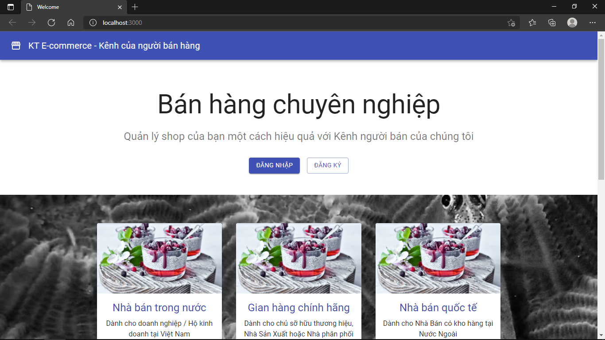
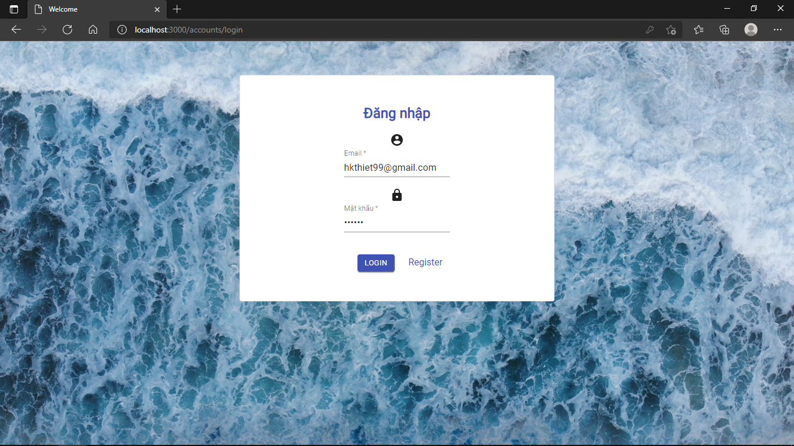
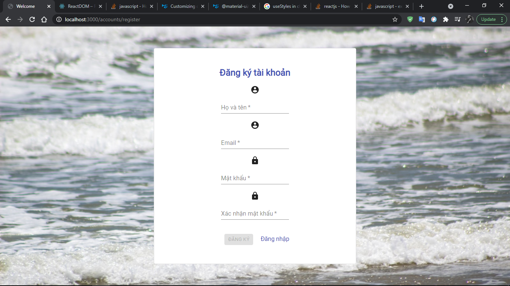

### My project in the research and development process ...
- Front-end: ReactJS
- Database: MongoDB
- Back-end: NodeJS

### In process

Xây dựng REST API dùng để quản lý thông tin tài khoản, quản lý thông tin sản phẩm và các đơn hàng. Thông tin chi tiết như sau:

	- Tài khoản: Người dùng có các thông tin: email, mật khẩu.
	- Sản phẩm: Gồm các thông tin: mã sản phẩm, tên sản phẩm, giá, mô tả.
	- Đơn hàng: Gồm các thông tin: mã đơn hàng, tổng giá bán, danh sách sản phẩm của các Sản phẩm trong đơn hàng.

#### Details
- Tất cả dữ liệu lưu trong MongoDB được kết nối với NodeJS 
- Sử dụng Express Router để hiện  thực các chức năng riêng biệt, gồm có: AccountRouter, ProductRouter, OrderRouter.
- REST API có 2 endpoint là products và accounts...
- Sử dụng bcrypt để hash mật khẩu, sử dụng JWT để xác thực người dùng
- Cors cho phpes mọi web client tương tác được với website, rate limit chống DDOS

#### Demo UI
Welcome page

Login page

Register page

