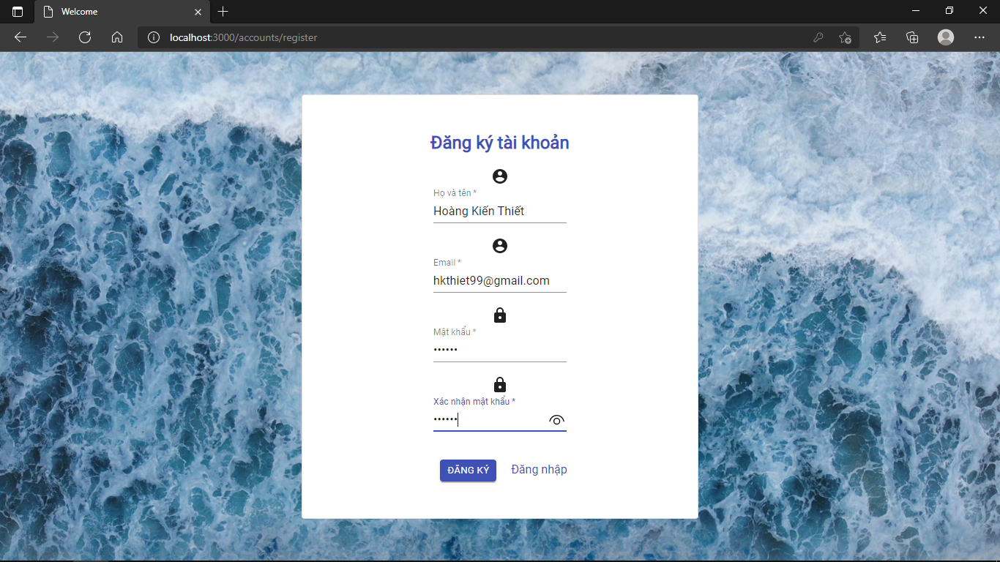

## My project is demonstrates the following
### Backend
  - API to register and login user.
  - API using which loged in user can add, edit and update it's product.
  - Pagination API to give list of perticular user's added product.
  - JWT token authentication.
### Frontend
  - Creating a Component in React and creat routing.
  - Using react and material UI created form to login user and can register new user.
  - Product add, edit, delete and pagination also you can search product by name.
  - Making HTTP calls using Axios.
  - Calling multipart api with image upload.

### Prerequisites
Below noted things you need to install to run this project in your system
  - Node.js
  - NPM
  - MongoDB : DB Name: `SalesWebsite`

### To Setup
Clone or download this repository
1. `cd KT-Ecommerce/backend `
2. `npm install`
3. Then `npm start`
4. new terminal, `cd KT-Ecommerce/frontend` and `npm install`, then `npm start` same above

### Some Screens
# Welcome 

# Login

# Register

# Home

# Add and update 

 

# Search

# Success and Error

 
